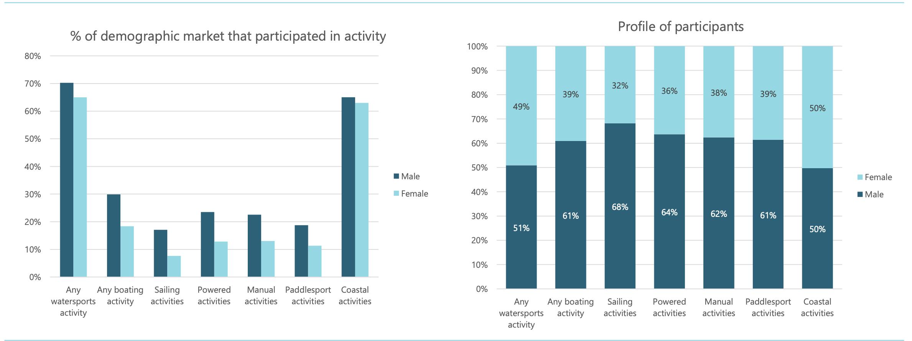

```{r, echo = FALSE, message = FALSE}
source(here::here("scripts/setup.R"))
```

# 4. <strong>EDA</strong>

## 4.1 Evolution of shark attacks through the years


With the y-axis showing the frequency of shark attacks and the x-axis showing the passage of time, the graph below displays a striking pattern in shark attacks over time. The data exhibits a recognizable pattern that indicates a steady increase in the quantity of shark attacks within the designated period. This rising tendency begs critical concerns regarding what is causing such an increase and necessitates more research into ecological, environmental, and human-related elements that could be involved in this occurrence. The graph emphasizes the need of keeping an eye on and comprehending the dynamics of these episodes in addition to providing a visual depiction of the rise in shark attacks. 

This trend is a key research topic: why are marine attacks increasing year after year? What could be the reasons? In fact, the reasons can be various, for example of an ecological, environmental nature or linked to human seaside activity. The graph highlights the need to keep an eye on and understand the dynamics of these episodes, which is exactly what we will do during our study.

One might ask himself/herself why there is a huge drop in shark attacks between2019-2020. The answer is simple: our dataset presents data up to June 2018, for the second half of the year we have no data, which explains the drastic drop in attacks.

```{r}
ggplot(data = final_attacks_cleaned, aes(x = Year)) +
  geom_smooth(stat = "count", aes(group = 1), color = "blue", size = 1) +
  geom_bar(stat = "count", fill = "red") +
  labs(title = "Shark Attacks Evolution Over Years", x = "Year", y = "Number of Attacks")


```


To take a look at how this evolution happens within males and females, we can run another plot showing that males have always been the sex facing more attacks.
```{r}

# Create a plot to show the trend of shark attacks throughout the years, including victim's sex (interactive version)
attacks_evolution_sex <- ggplot(data = final_attacks_cleaned, aes(x = Year, fill = Sex)) +
  geom_bar(position = "stack", color = "white") +
  labs(title = "Shark Attacks Evolution Over Years by Sex",
       x = "Year",
       y = "Number of Attacks",
       fill = "Sex") +
  scale_fill_manual(values = c("pink", "blue", "orange"), name = "Sex") +
  theme_minimal()


interactive_attacks_evolution_sex <- ggplotly(attacks_evolution_sex)
interactive_attacks_evolution_sex

```

## 4.2 Density of shark attacks per country

This engaging interactive map reveals a depiction of worldwide shark attack data per country.The map uses a color gradient to dynamically depict the intensity of shark attacks. What are the trends we can observe? The United States of America, Australia, and South Africa standing out as hubs of increased shark activity. According to our visualization, these areas might have special ecological features or human activity that draws sharks. 

Meanwhile, Brazil and the Bahamas secure the second spot as a group, and finally, most nations on Earth report less than 50 shark attacks.

Our assumption is that there might be a different density and frequency of the the impact of human activity in each of these areas, different marine biodiversity and geographic features, which a complex web of variables that affects shark attaks happening more in some parts of the world rather than others. 

```{r}

#Import the data concerning the map
map <- read.csv(here::here("data/map.csv"))
map <- map[c('latitude', 'longitude', 'country')]

#Let's rename the columns of the dataset
colnames(map)[colnames(map) == 'latitude'] <- 'lat'
colnames(map)[colnames(map) == 'longitude'] <- 'lng'
colnames(map)[colnames(map) == 'country'] <- 'Country'
map$Country <- toupper(map$Country)

map$Country <- ifelse(map$Country == "UNITED STATES", "USA", map$Country)
merged_map <- merge(merged_data3, map, by = "Country", all = FALSE)

# Create a new variable representing the nb of attacks per country
results <- merged_map %>%
  group_by(Country) %>%
  summarise(Attackscountry = n())
print(results)

#Attach aggregated data to your original dataframe
merged_map <- left_join(merged_map, results, by = "Country")

# Definition of the thresholds for the categorization
seuils <- c(0, 50, 100, 500, Inf)

# Definition of the colors we want to have in the map
#couleurs <- c("#4DA6FF", "#0074CC", "#6C8EBF", "#001F3F80")
couleurs <- c("green", "yellow", "orange", "red")

# Add a new category column based on thresholds
merged_map$cat_attacks <- cut(merged_map$Attackscountry, breaks = seuils, labels = FALSE)

merged_map$echelle_taille <- merged_map$Attackscountry * 0.1

# Let's have fun with an interactive map
ma_carte <- leaflet(merged_map) %>%
  setView(lng = -95, lat = 37, zoom = 2) %>%
  addTiles() %>%
  addCircleMarkers(
    lng = ~lng,
    lat = ~lat,
    radius = ~sqrt(echelle_taille) * 2,
    color = ~factor(merged_map$cat_attacks, labels = couleurs),
    fillOpacity = 0.4,
    label = ~paste(Country, ":", Attackscountry),
    options = markerOptions(autoPopup = TRUE)
  ) %>%
  addLegend(
    position = "bottomleft",
    colors = couleurs,
    labels = c("Less than 50", "50 to 100", "100 to 500", "More than 500"),
    title = "Number of shark attacks"
  )

# Personnaliser le style CSS pour la carte
ma_carte$dependencies[[1]]$stylesheet <- "leaflet.css"

# Ajouter du style personnalisé
ma_carte$dependencies[[1]]$inline <- TRUE
ma_carte$dependencies[[1]]$script <- "$('#map').css({'width': '80%', 'height': '300px', 'float': 'left'});"


# Let's see the map
ma_carte
```

<strong>Pattern of shark attacks frequencies per country</strong> 

We decided to also run a barplot in other to observe the top 10 countries with the highest amount of shark attacks. It was useful to observe the placing of each country in a more straight-forward way.

```{r}
shark_attacks_by_country <- final_attacks_cleaned %>%
  group_by(Country) %>%
  summarise(total_attacks = n())

shark_attacks_by_country <- shark_attacks_by_country %>%
  mutate(CountryCategory = ifelse(total_attacks >= 30, as.character(Country), "Other"))

# Order the countries by frequency in descending order
shark_attacks_by_country$CountryCategory <- reorder(shark_attacks_by_country$CountryCategory, -shark_attacks_by_country$total_attacks)

# Plot the data
plot2<- ggplot(data = shark_attacks_by_country, aes(x = total_attacks, y = CountryCategory)) +
  geom_col(fill = "skyblue") +
  labs(title = "Total Shark Attacks in Each Country", x = "Number of Attacks", y = "Country") +
  theme_minimal() +
  theme(axis.text.y = element_text(hjust = 1)) +
  scale_y_discrete(labels = scales::label_wrap(10))

interactive_plot <- ggplotly(plot2)
interactive_plot

```

<strong>What are the continents that have the most attacks?</strong>

Finally, through a chart that combines countries in continents, we are able to illustrate the regions with the highest number of attacks since 1970, with North America and Australia and Oceania taking the lead. This is even more surprising than before! Asia, the continents that counts for 59.72% (Statista, 2022) of the world population does not even figure here. This fact intrigued us even more to go deeper and find out the real causes of shark attacks.


```{r}

#Create a new column in attacks that represents the continents
attacks_grouped <- final_attacks_cleaned %>%
  mutate(Region = case_when(
    ISO_Code %in% c(NA) ~ "Unknown",
    ISO_Code %in% c("AFG", "ARM", "AZE", "BHR", "BGD", "BTN", "BOL", "BGR", "BFA", "BDI", "KHM", "CMR", "CPV", "CHN", "CXR", "CYP", "HKG", "IND", "IDN", "IRN", "IRQ", "ISR", "JOR", "JPN", "KAZ", "KWT", "KGZ", "LAO", "LBN", "MAC", "MYS", "MDV", "MNG", "MMR", "NPL", "PRK", "OMN", "PAK", "PSE", "PHL", "QAT", "SAU", "SGP", "KOR", "LKA", "TUR", "SYR", "TWN", "TJK", "THA", "TKM", "ARE", "UZB", "YEM", "VNM") ~ "Asia",
    ISO_Code %in% c("ALB", "AND", "AUT", "BLR", "BEL", "BIH", "BWA", "HRV", "CZE", "DNK", "EST", "FIN", "FRO", "FRA", "GEO", "DEU", "GRC", "GRL", "GLP", "HUN", "ISL", "IRL", "ITA", "LVA", "LTU", "LIE", "LUX", "MLT", "MDA", "MNE", "NLD", "MKD", "NOR", "POL", "PRT", "ROU", "RUS", "SRB", "SVK", "SVN", "ESP", "SWE", "CHE", "UKR", "GBR") ~ "Europe",
    ISO_Code %in% c("DZA", "AGO", "BEN", "CAF", "TCD", "COM", "COG", "CIV", "COD", "DJI", "TLS", "EGY", "ERI", "SWZ", "ETH", "GNQ", "GAB", "GMB", "GHA", "GIN", "GNB", "KEN", "LSO", "LBR", "LBY", "MDG", "MWI", "MLI", "MTQ", "MRT", "MUS", "MYT", "MAR", "MOZ", "NAM", "NER", "NGA", "REU", "RWA", "SHN", "SEN", "SYC", "SLE", "STP", "ZAF", "SOM", "SSD", "SDN", "SUR", "TZA", "TGO", "TUN", "UGA", "ZMB", "ZWE") ~ "Africa",
    ISO_Code %in% c("AIA", "ATG", "ABW", "BHS", "BMU", "BRB", "BLZ", "VGB", "BRN", "CAN", "CRI", "CUB", "CUW", "DMA", "DOM", "SLV", "GRD", "GTM", "HTI", "HND", "JAM", "MSR", "MEX", "USA", "NIC", "PAN", "KNA", "LCA", "SPM", "VCT", "SXM", "TCA", "TTO") ~ "North America",
    ISO_Code %in% c("ARG", "COL", "CHL", "ECU", "GUF", "GUY", "PRY", "PER", "URY", "VEN", "BRA", "BES") ~ "South America",
    ISO_Code %in% c("AUS", "COK", "FJI", "PYF", "KIR", "MHL", "FSM", "NRU", "NCL", "NZL", "NIU", "PLW", "PNG", "WSM", "SLB", "TON", "TUV", "VUT", "WLF") ~ "Australia & Oceania",
    ISO_Code %in% c("ATA") ~ "Antarctica"
  ))


# Filter data to include only valid regions (excluding "Unknown")
filtered_attacks_region <- attacks_grouped %>% 
  filter(!is.na(Region) & Region != "Unknown")

# Bar plot to show the distribution of shark attacks by region
interactive_bar_plot_region_attacks <- ggplotly(
  ggplot(filtered_attacks_region, aes(x = Region, fill = Region)) +
    geom_bar() +
    labs(title = "Distribution of Shark Attacks by Region",
         x = "Region",
         y = "Number of Attacks") +
    theme(axis.text.x = element_text(angle = 45, hjust = 1)) # Rotate x-axis labels for better readability
)


# Display the interactive bar plot
interactive_bar_plot_region_attacks


```

## 4.3 Pattern of shark attacks frequencies

<strong> Pattern of shark attacks frequencies through the day</strong> 

The bar graph below, where the x-axis indicates four time categories —morning, afternoon, evening, and night— displays the distribution of shark attacks throughout the day. The graph's most noticeable aspect is how frequently shark attacks occur in the afternoon, followed by the morning, evening and night. This concentration of incidents in the afternoon raises intriguing questions about potential human behavioral factors that could contribute to this temporal pattern. 

First and foremost, we believe that the afternoon is when most people choose to go swimming, which contributes to the frequency of shark attacks during this time. Recreational water activities such as swimming, surfing, kayaking, and other water sports are probably more popular during these times. Furthermore, the afternoon is when the seas are the warmest, so it's intriguing to find out if this aspect also has a significant influence on shark activity.
Conversely, the decreased number of assaults that occur at night may be related to less people using the water during that time, but there may be other possible reasons as well (less high temperatures, poorer visibility).

Lastly, we suppose that the medium frequencies of the morning and evening might correspond to transitional periods when shark and human behavior are changing.

```{r}

bar_colors <- c("#66c2a5", "#fc8d62", "#8da0cb", "#e78ac3")

# Create a sorted table
sorted_table <- table(final_attacks_cleaned$Time)
sorted_table <- sorted_table[order(-sorted_table)]

# Create a bar plot with the sorted data
barplot1 <- barplot(sorted_table,
                    col = bar_colors,
                    xlab = "Time of Day", ylab = "Frequency of Attacks",
                    main = "Frequency of Shark Attacks by Time of Day",
                    border = "white",
                    ylim = c(0, 1800),
                    space = 0.5,
                    cex.names = 0.8,
                    font.axis = 2,
                    beside = TRUE)


# Add text labels with frequencies on the bars
text_labels <- sorted_table
text(x = barplot1, y = sorted_table, labels = text_labels, pos = 3, cex = 0.8, col = "black")


```


<strong>Better understanding of the attacks and the sex of the victims</strong>

We initially believed that men experienced attacks more frequently, but our surprise grew when we examined this chart. It highlights a substantial disparity in the distribution of attacks between men and women.

```{r}
# Create a summary table with the count of attacks for each sex
attacks_summary_sex <- final_attacks_cleaned %>%
  group_by(Sex) %>%
  summarise(NumAttacks = n())

# Define the desired order of levels
sex_order <- c("M", "F", "Unknown")

# Convert the 'Sex' variable to a factor with the specified order
attacks_summary_sex$Sex <- factor(attacks_summary_sex$Sex, levels = sex_order)

# Bar plot to show the distribution of shark attacks by sex
interactive_bar_plot_sex_attacks <- ggplotly(
  ggplot(attacks_summary_sex, aes(x = Sex, y = NumAttacks, fill = Sex)) +
    geom_bar(stat = "identity", position = "dodge", width = 0.7) +
    labs(title = "Distribution of Shark Attacks by Sex",
         x = "Sex",
         y = "Number of Attacks") +
    scale_fill_manual(values = c("blue", "pink", "gray"))
)

# Display the interactive bar plot
interactive_bar_plot_sex_attacks

```


To keep up with this trend, we thought about looking for a survey that indicates the type of recreational water activity that each participant is more inclined do. Starting from this survey, we would have classified the activities by risk level to then see if it is actually true that, beyond our dataset, it is males who carry out more risky activities. Unfortunately, despite our long searches, we were unable to find such a dataset. As a result, we looked for a study that had already been done. In the image below, you can find a research carried out by the Marine and Coastguard Agency: this reports the "Proportion of each gender group participating (to recreational water activities) and gender profile of participants" (Marine and Coastguard Agency, 2022).

The study confirms our assumption that generally, it is men who practice more recreational water activities, even if the difference between men and women is very low. Furthermore, men are more frequently inclined to do Boating and Sailing activities, both considered to have a more likely direct impact with a shark than "coastal activities" (such as Beachcombing, Cliff climbing or Spending General Leisure Time At The Beach, as cited on the report), considered safer.





<strong>Fatalities by type of shark</strong> 

As we can see in this graph, most of attacks were not fatal, meaning that sharks injured a lot of people without taking their lives away. The types of sharks that did the most of accidents were the following ones: Bull shark, Tiger shark and White shark, with the deadlies being the last one. Why do they commit attacks? Probably because their feeding behavior. Maybe they misidentify their predators attacking people instead of animals like turtles, seals, or sea lions. This is consistent with Bull shark and Tiger shark being repetitevly named as the deadlies sharks in the seas and oeceans (CBS News, 2010).
Another relevant information derived from this graph is the big number of unidentified sharks. Out of all the attacks recorded by our dataset, we have almost 1750 Unidentified species. It is such a pity not to be able to have this information, which would have led us to more insightful results.


```{r}

# Merge the two shark species in the "Species" column
final_attacks_cleaned <- final_attacks_cleaned %>%
  mutate(Species = ifelse(Species %in% c("Unidentifies shark", "Unidentified shark"), "Unidentified shark", Species))

# Get the top 10 shark species
top_10_sharks <- head(names(sort(table(final_attacks_cleaned$Species), decreasing = TRUE)), 10)

# Subset the data to include only the top 10 shark species
final_attacks_top_10 <- final_attacks_cleaned[final_attacks_cleaned$Species %in% top_10_sharks, ]

# Create the summary table for the top 10 shark species
summary_table_top_10 <- table(final_attacks_top_10$Species, final_attacks_top_10$Fatality)

# Convert the summary table to a data frame
summary_df_top_10 <- as.data.frame(summary_table_top_10)

# Create the ggplot with the top 10 shark species
plot_top_10 <- ggplot(summary_df_top_10, aes(x = Var1, y = Freq, fill = Var2)) +
  geom_bar(stat = "identity") +
  labs(
    title = "Fatality by Top 10 Types of Shark",
    x = "Type of Shark",
    y = "Frequency",
    fill = "Legend"
  ) +
  theme(axis.text.x = element_text(angle = 45, hjust = 1)) +
  scale_fill_manual(
    name = "Was the shark attack fatal?",
    values = c("blue", "pink", "yellow"),
    labels = c("Yes", "No", "Unknown")
  )

# Display the plot
print(plot_top_10)

```


<strong>What are the activities with the most attacks?</strong>

Identifying the activities most commonly targeted by shark attacks was a crucial aspect of our analysis. The results underscore that among various water-related activities, surfing stands out as the predominant target, with 903 attacks recorded since 1970, making it the preferred activity for sharks. This is not a surprise as the similarity in shape between a surfboard and a seal may lead sharks to mistake the two, providing a plausible explanation for the higher incidence of attacks during surfing.

```{r}

# Check the top activities with the most attacks
top_activities <- final_attacks_cleaned %>%
  group_by(Activity, Sex) %>%
  summarize(Number_of_Attacks = n()) %>%
  arrange(desc(Number_of_Attacks)) %>%
  top_n(30)  # Adjust the number if you want more or fewer top activities

# Plot the results
top_activities_attacks <- ggplot(top_activities, aes(x = reorder(Activity, -Number_of_Attacks), y = Number_of_Attacks, fill = Sex)) +
  geom_bar(stat = "identity") +
  labs(title = "Top Activities with the Most Attacks",
       x = "Activities",
       y = "Number of Attacks",
       fill = "Sex") +
  scale_fill_manual(values = c("pink", "blue", "orange"), name = "Sex") +
  theme_minimal() + 
  theme(axis.text.x = element_text(angle = 45, hjust = 1))


interactive_top_activities_attacks <- ggplotly(top_activities_attacks)
interactive_top_activities_attacks


```

<strong>How is the relationship between the attacks and the age of the victims?</strong>

There exists a negative correlation between the age of the victim and the frequency of attacks. This can be attributed to factors such as the higher water engagement of teens and adults below 40 compared to older individuals, leading to a greater involvement in water-related activities.

```{r}

# Create a summary table with the count of attacks for each age
attacks_summary <- final_attacks_cleaned %>%
  group_by(Age) %>%
  summarise(NumAttacks = n())

# Scatter plot to show the relationship between the number of shark attacks and age
interactive_attacks_age <- ggplotly(
  ggplot(attacks_summary, aes(x = Age, y = NumAttacks)) +
    geom_point(color = "blue", size = 2) +
    geom_smooth(method = "lm", se = FALSE, color = "red") +  # Add a linear trend line
    labs(title = "Relationship between Shark Attacks and Age",
         x = "Age",
         y = "Number of Attacks")
)

interactive_attacks_age

```


## 4.4 Evolution of sea level through the years

This line graph depicts the trend of rising sea levels from around the ‘90s until the early 2020s, showing some fluctuations initially, and a notable upward trend thereafter. The early 2000s represent a steady rate of increase, with a minor decrease in the early 2010s. This pattern appears to be somewhat consistent with global temperature changes, and a steepening rise in the last couple of years indicate a complementary relation with the increasing temperature levels. 


```{r}
# Create a line plot
plot6 <- ggplot(data = final_sealevel_cleaned, aes(x = Year, y = GMSL_GIA)) +
  geom_line(color = "green", size = 1.5) +
  labs(title = "Evolution of Sea Level Over the Years", x = "Year", y = "Sea Level")

interactive_plot <- ggplotly(plot6)
interactive_plot
```

<strong>Does sea level and the number of shark attacks have a relationship?</strong>

Our first conclusion from the previous graph is that both sea level and shark attakcs variations follow the same pattern: they are increasing through time! Let us plot this better in another graph.

We can discern a positive correlation between the increase in sea levels and the occurrence of shark attacks. This observation is particularly intriguing since we can ask ourselves: is this a coincidence or increasing sea levels really infleunce the occurrence of shark attacks? Well, while taking this in mind, we try to plot other global warming consequences with shark attacks to see if there is any visible pattern.

```{r}
# Calculate the number of attacks per year
attacks_summary <- final_attacks_cleaned %>%
  group_by(Year) %>%
  summarize(Number_of_Attacks = n())

# Assuming there's a common column named "Year" in both datasets
merged_data5 <- merge(attacks_summary, sealevel, by = "Year", all.x = TRUE)

correlation_coefficient <- cor(merged_data5$Number_of_Attacks, merged_data5$GMSL_GIA, use = "complete.obs")

# Scatter plot
interactive_scatter_plot_sea_level_attacks <- ggplotly(
  ggplot(merged_data5, aes(x = GMSL_GIA, y = Number_of_Attacks)) +
    geom_point() +
    geom_smooth(method = "lm", se = FALSE, color = "red") +  # Add a linear trend line
    labs(title = "Relationship Between Sea Level and Shark Attacks",
         x = "Global Mean Sea Level Global Isostatic Adjustment (GMSL_GIA)",
         y = "Number of Attacks")
)

# Display the interactive scatter plot
interactive_scatter_plot_sea_level_attacks


```


## 4.5 CO2 emissions insights

<strong>Trend of CO2 emissions per year</strong> 

The bar graph reveals an evident increase of emissions in the depicted period, as indicated by a consistent upward trend with few fluctuations and no significant declines. The rise reflects the growth of industrialisation over the years, especially marked by the end of the Cold War and subsequent economic growth in many parts of the world. The early 2000s show a particularly sharp increase, which is likely to be as a result of the rapid increase in manufacturing and energy production in Asian regions. Post-2010 years show some fluctuations that could be attributed to emissions mitigation efforts, but the trend overall remains the same.


```{r}
# Create a line plot with backticks to show the trend in co2 emissions throughout the years
plot7 <- ggplot(data = final_ghg_cleaned, aes(x = Year, y = `Annual CO2 Emissions`)) +
  geom_line(color = "blue") +
  labs(title = "Trend of CO2 Emissions Over the Years", x = "Year", y = "Annual CO2 Emissions")

interactive_plot <- ggplotly(plot7)
interactive_plot
```

<strong>Which continent generates more GHG emissions? </strong> 

We can see that there is a significant disparity in emissions among different continents; Asia shows a sharp increase in emissions over the years, particularly accelerating after 2000, becoming the continent with the highest CO2 emissions. This is perfectly consistent with other data, showing that 5 out of the 6 most polluting countries in the world are in Asian, namely China, India, Japan, Russia and Iran. (Statista, 2021)
Emissions in Europe depict a gradual rise until the early 90’s, with a noticeable fluctuation and decline thereafter. 
The North American region follows a similar trend to Europe with a steady increase until the 2000s, followed by a levelling off and a decline. 
On the other hand, CO2 emissions from South America show a steady increase over time with less fluctuations as compared to Europe and NA.
Africa’s emissions have additionally been increasing at a steady rate over the last few decades, but they remain significantly lower compared to the rest of the continents. 
Oceania represents the lowest overall emissions among the listed regions, with an increase rate on par with Africa.
Antarctica’s emissions are not visible on the graph, which is consistent with expectations as it is a largely uninhabited continent.


```{r, results='hide'}

co2_grouped <- final_ghg_cleaned %>%
  mutate(Region = case_when(
    ISO_Code %in% c(NA) ~ "Unknown",
    ISO_Code %in% c("AFG", "ARM", "AZE", "BHR", "BGD", "BTN", "BOL", "BGR", "BFA", "BDI", "KHM", "CMR", "CPV", "CHN", "CXR", "CYP", "HKG", "IND", "IDN", "IRN", "IRQ", "ISR", "JOR", "JPN", "KAZ", "KWT", "KGZ", "LAO", "LBN", "MAC", "MYS", "MDV", "MNG", "MMR", "NPL", "PRK", "OMN", "PAK", "PSE", "PHL", "QAT", "SAU", "SGP", "KOR", "LKA", "TUR", "SYR", "TWN", "TJK", "THA", "TKM", "ARE", "UZB", "YEM", "VNM") ~ "Asia",
    ISO_Code %in% c("ALB", "AND", "AUT", "BLR", "BEL", "BIH", "BWA", "HRV", "CZE", "DNK", "EST", "FIN", "FRO", "FRA", "GEO", "DEU", "GRC", "GRL", "GLP", "HUN", "ISL", "IRL", "ITA", "LVA", "LTU", "LIE", "LUX", "MLT", "MDA", "MNE", "NLD", "MKD", "NOR", "POL", "PRT", "ROU", "RUS", "SRB", "SVK", "SVN", "ESP", "SWE", "CHE", "UKR", "GBR") ~ "Europe",
    ISO_Code %in% c("DZA", "AGO", "BEN", "CAF", "TCD", "COM", "COG", "CIV", "COD", "DJI", "TLS", "EGY", "ERI", "SWZ", "ETH", "GNQ", "GAB", "GMB", "GHA", "GIN", "GNB", "KEN", "LSO", "LBR", "LBY", "MDG", "MWI", "MLI", "MTQ", "MRT", "MUS", "MYT", "MAR", "MOZ", "NAM", "NER", "NGA", "REU", "RWA", "SHN", "SEN", "SYC", "SLE", "STP", "ZAF", "SOM", "SSD", "SDN", "SUR", "TZA", "TGO", "TUN", "UGA", "ZMB", "ZWE") ~ "Africa",
    ISO_Code %in% c("AIA", "ATG", "ABW", "BHS", "BMU", "BRB", "BLZ", "VGB", "BRN", "CAN", "CRI", "CUB", "CUW", "DMA", "DOM", "SLV", "GRD", "GTM", "HTI", "HND", "JAM", "MSR", "MEX", "USA", "NIC", "PAN", "KNA", "LCA", "SPM", "VCT", "SXM", "TCA", "TTO") ~ "North America",
    ISO_Code %in% c("ARG", "COL", "CHL", "ECU", "GUF", "GUY", "PRY", "PER", "URY", "VEN", "BRA", "BES") ~ "South America",
    ISO_Code %in% c("AUS", "COK", "FJI", "PYF", "KIR", "MHL", "FSM", "NRU", "NCL", "NZL", "NIU", "PLW", "PNG", "WSM", "SLB", "TON", "TUV", "VUT", "WLF") ~ "Australia & Oceania",
    ISO_Code %in% c("ATA") ~ "Antarctica"
  ))


# Step 1: Calculate Mean Emissions by Year and Region
mean_emissions <- co2_grouped %>%
  group_by(Year, Region) %>%
  summarize(Mean_Emissions = mean(`Annual CO2 Emissions`, na.rm = TRUE))


# Now we get rid of that Unknown Region to have a better view of the other Regions

# Step 1: Calculate Mean Emissions by Year and Region and getting rid of the things we don't want
mean_emissions <- co2_grouped %>%
  filter(!is.na(Region) & !is.na(`ISO_Code`) & Region != "Unknown") %>%
  group_by(Year, Region) %>%
  summarize(Mean_Emissions = mean(`Annual CO2 Emissions`, na.rm = TRUE))


```

```{r}
# Step 2: Let's plot the Data
plot2 <- ggplot(mean_emissions, aes(x = Year, y = Mean_Emissions, color = Region)) +
  geom_line() +
  labs(title = "CO2 Emissions by Continent",
       x = "Year",
       y = "Annual CO2 Emissions") +
  theme_minimal()

interactive_plot <- ggplotly(plot2)
interactive_plot
```

<strong>What are the countries with the most CO2 emissions?</strong>

Here is a plot to further illustrate the distribution of CO2 emissions in the world; the top 30 countries with the most shark attacks since 1970. One interesting thing is that most countries are European countries. But what is more interesting is that, nevertheless, the emissions by countries like USA, China, Russia, Japan and India are so high that European countries cannot even cope with them. 

```{r}
# Filter out 'OWID_WRL' from the data
co2_filtered_wrl <- final_ghg_cleaned %>% filter(ISO_Code != "OWID_WRL")

# Select the top 30 countries based on CO2 emissions
top30_countries <- co2_filtered_wrl %>%
  group_by(ISO_Code) %>%
  summarize(`Annual CO2 Emissions` = sum(`Annual CO2 Emissions`)) %>%
  arrange(desc(`Annual CO2 Emissions`)) %>%
  top_n(30)

# Create an interactive bar plot
interactive_top30_countries_co2 <- ggplotly(
  ggplot(data = top30_countries, aes(x = reorder(ISO_Code, -`Annual CO2 Emissions`), y = `Annual CO2 Emissions`)) +
    geom_bar(stat = "identity", fill = "skyblue") +
    labs(title = "Top 30 Countries with the Most CO2 Emissions", x = "Countries", y = "Annual CO2 Emissions") +
    theme(axis.text.x = element_text(angle = 45, hjust = 1))
)

# Display the interactive bar plot
interactive_top30_countries_co2

```

## 4.6 Evolution of temperatures through the years

The graph below illustrates the change in global temperature throughout the last few decades, showing an overall increase in temperature over the 50-year period. Despite some fluctuations, the upward trend indicates a clear warming pattern, with a notable acceleration following the 1980s and one of the two most significant rises occurring in the recent decade.


```{r}
# Filter out NA values and non-numeric values in the Temperature column
temperature_data_filtered <- final_temperature_cleaned %>%
  filter(!is.na(Temperature), !is.na(as.numeric(Temperature)))

# Convert the Temperature column to numeric
temperature_data_filtered$Temperature <- as.numeric(temperature_data_filtered$Temperature)

# Calculate the mean temperature for each year
world_temperature <- temperature_data_filtered %>%
  group_by(Year) %>%
  summarise(World_Temperature = mean(Temperature, na.rm = TRUE))

# Create a line plot for the world temperature
plot5 <- ggplot(world_temperature, aes(x = Year, y = World_Temperature)) +
  geom_line() +
  labs(title = "World Temperature Change Over Years",
       x = "Year",
       y = "World Temperature Change") +
  theme_minimal()

interactive_plot <- ggplotly(plot5)
interactive_plot

```


<strong>How is the relationship between temperature change and the number of shark attacks?</strong>

In addition to the previous plot, it is evident that there is a positive correlation between global temperatures and the frequency of shark attacks. This further strengthens our assumption of a possible link between global warming and shark attacks occurrences

```{r}

# Identify non-numeric values in the Temperature column
non_numeric_temp <- final_temperature_cleaned %>%
  filter(!is.numeric(Temperature)) %>%
  distinct(Temperature)

# Convert "Temperature" column to numeric
final_temperature_cleaned$Temperature <- as.numeric(final_temperature_cleaned$Temperature)

# Check for negative values
negative_values <- final_temperature_cleaned %>%
  filter(Temperature < 0)

# Calculate the mean temperature
mean_temp_world <- final_temperature_cleaned %>%
  group_by(Year) %>%
  summarize(Mean_Temperature = mean(Temperature, na.rm = TRUE))

# Filter out non-numeric values in the Temperature column
temperature2 <- final_temperature_cleaned %>%
  filter(is.numeric(Temperature))

# Calculate mean temperature for the world per year
mean_temp_world <- temperature2 %>%
  group_by(Year) %>%
  summarize(Mean_Temperature = mean(Temperature, na.rm = TRUE))

# Merge datasets
merged_data6 <- merge(attacks_summary, mean_temp_world, by = "Year", all.x = TRUE)

# Plotting
interactive_scatter_plot_worldtemperature_attacks <- ggplotly(
  ggplot(merged_data6, aes(x = Mean_Temperature, y = Number_of_Attacks)) +
    geom_point() +
    geom_smooth(method = "lm", se = FALSE, color = "red") +  # Add a linear trend line
    labs(title = "Relationship between Shark Attacks and World Mean Temperature Change",
         x = "World Mean Temperature Change",
         y = "Number of Shark Attacks") +
    theme_minimal()
)


interactive_scatter_plot_worldtemperature_attacks

```

## 4.7 Final Considerations

Above all, the apparent pattern of an annual increase in shark attacks has aroused interest and prompted research into the main variables that serve as significant triggers for the occurrence of these events. Given that the graphs and plots showed a clear preference for male victims and that males die at a higher rate than females, a thorough investigation is necessary to understand the complex interactions between gender dynamics and shark attacks. Moreover, the discovery that shark attacks occur more frequently during the day provides a crucial basis for deciphering the environmental complexities surrounding these incidents, raising the question of whether daytime variations play a significant role in shark attack occurrences.

Examining the variables that contribute to the lethality of the encounters with sharks, the investigation broadens to examine why those accidents are more lethal in certain circumstances rather than others, and what is the network of variables that affect how deadly shark encounters can be.

Our research integrates into the larger framework of climate change, going beyond the specific topic of shark attacks. A comparison of the time trends of shark attacks with increasing greenhouse gas (GHG) emissions, rising sea levels, and rising temperatures reveals a fascinating relationship that drives the development of the final research question, which aims to understand whether global warming correlates with the increase of shark attacks.
